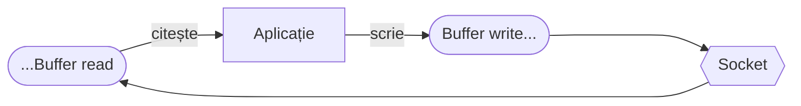

### Clasa `stream.Duplex`

Sunt acele stream-uri bidirecționale în care se poate scrie și citi deopotrivă. Are nevoie să fie *writable* pentru a se putea face **pipe** datelor de input pe care le putem introduce. Trebuie să fie *readable* pentru a se putea face **pipe** datelor transformate către următorul bloc de transformare din lanț, dacă acesta există.

O aplicație conectată la un stream duplex poate citi și scrie în stream-ul duplex. Un exemplu ar fi `net.Socket`.

Într-un stream duplex, partea care citește este separată de cea care scrie și fiecare are propriul `Buffer`.



Un stream duplex reprezintă secțiunea mediană a unui pipeline. Adu-ți mereu aminte că un stream duplex pasează datele de la un stream readable mai departe. Dacă dorești să și transformi datele, va trebui să creezi un stream de transformare pe care să-l pui între un stream readable și un writable.

```javascript
const {Duplex, PassThrough} = require('stream');
const {createReadStream, createWriteStream} = require('fs');
const rStream = createReadStream('./ceva.mp4');
const wStream = createWriteStream('./altceva.mp4');

// Clasă cu ajutorul căreia întârziem pasarea datelor.
class Throttle extends Duplex {
  constructor (ms) {
    super();
    this.delay = ms;
  }

  _read () {

  }

  _write (chunk, ecoding, cb) {
    // ne referim la însuși streamul
    this.push(chunk);
    setTimeout(cb, this.delay);
  }

  _final () {
    this.push(null); // când nu ma e nimic ca date, trimite null pentru a se opri citirea și scrierea.
  }
}

const throttle = new Throttle(100);
const raport = new PassThrough(); // un stream duplex (poate face trasformări)

let alldata = 0;
raport.on('data', (chunk) => {
  alldata += chunk.length;
  console.log('bytes: ', alldata);
});

rStream.pipe(throttle).pipe(raport).pipe(wStream);
```

## Verificare Duplex

Pentru a verifica dacă un stream este un `Duplex`, putem adopta o metodă similară cu următoarea funcție pe care 30 seconds of code o propune.

(1) Mai întâi verifici ca valoarea primită să nu fie `null`;
(2) Folosești `typeof` pentru a verifica dacă valoarea primită este de tip obiect și apoi dacă are o metodă `pipe()`, care, evident, să fie funcție;
(3) Suplimentar verifici să existe metodele `_read` și `write`;
(4) Verifici să existe obiectele `_readableState` și `_writableState`.

```javascript
const isDuplexStream = val =>
  val !== null &&
  typeof val === 'object' &&
  typeof val.pipe === 'function' &&
  typeof val._read === 'function' &&
  typeof val._readableState === 'object' &&
  typeof val._write === 'function' &&
  typeof val._writableState === 'object';

const Stream = require('stream')
isDuplexStream(new Stream.Duplex()); // true
```

## Resurse

- [Implementing a duplex stream](https://nodejs.org/api/stream.html#stream_implementing_a_duplex_stream)
- [isDuplexStream | 30secondsofcode.org](https://www.30secondsofcode.org/js/s/is-duplex-stream)
