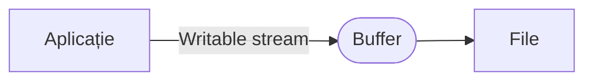

# Clasa `stream.Writable`

Sunt o abstractizare a ceea ce putem înțelege a fi o *destinație*. Sunt stream-urile cu care se pot scrie date, de exemplu. Aceste stream-uri preiau datele de la aplicație și le scriu într-o anumită destinație. Pentru a preveni pierderea datelor în cazul în care destinația nu are capacitatea de procesare care să țină pasul cu volumul datelor, acestea vor fi scrise într-un `Buffer`.



Cel mai simplu exemplu de stream `Writable` este un obiect `response`, precum în exemplul de mai jos:

```javascript
const server = require('http').createServer();
server.on('request', function (req, res) {
  res.write('Salut, ');
  res.write('Ionuț!');
  res.end();
});
server.listen(3000);
```

În cazul apelării serverului folosind `curl`, de exemplu, pentru o comandă `curl http://localhost:3000`, răspunsul va fi `Salut, Ionuț`.

## Cum testezi dacă este un stream Writable

```javascript
const isWritableStream = val =>
  val !== null &&
  typeof val === 'object' &&
  typeof val.pipe === 'function' &&
  typeof val._write === 'function' &&
  typeof val._writableState === 'object';

const fs = require('fs');
isWritableStream(fs.createWriteStream('test.txt')); // true
```

## Exemple de stream-uri Writable

Posibilele stream-uri `Writable`:

- HTTP requests, pe partea de client,
- HTTP responses, pe partea de server,
- `fs` - stream-urile *write* (`fs.createWriteStream`),
- stream-uri `zlib`,
- stream-uri `crypto`,
- socket-uri TCP,
- procesele copil `stdin`
- `process.stdout`, `process.stderr`.

Unele dintre aceste stream-uri sunt `Duplex`. Streamurile *Duplex* sunt readable dar și writable. Un exemplu rapid ar fi socketurile de rețea.

```javascript
const fs = require('fs');
const unStream = fs.createWriteStream('./unFisier.txt');
unStream.write('ceva date');
unStream.write('mai adug ceva date');
unStream.end('am terminat de scris datele'); // întotdeauna închide
```

## Evenimentele stream-urilor writable

### Evenimentul `close`

Acest eveniment este emis atunci când stream-ul și resursele sale interne (de exemplu un descriptor de fișier) au fost închise. Aceste eveniment odată emis, marchează faptul că nu vor mai fi emise alte evenimente pentru că alte operațiuni nu vor mai fi făcute.

Dacă un stream va fi creat având setată opțiunea `emitClose`, acesta va emite mereu evenimentul `close`.

### Evenimentul `drain`

Acest eveniment este semnalul că stream-ul writable poate primi date nou din stream. De exemplu, dacă apelul la `stream.write(chunk)` returnează `false`, evenimentul `drain` va fi emis pentru o posibilă preluare de date noi din stream.

### Evenimentul `error`

Este un eveniment care este emis atunci când a apărut o eroare în timpul scrierii sau introducerii datelor într-un stream.

### Evenimentul `finish`

Evenimentul este emis după apelarea metodei `stream.end()` și după ce toate datele au fost trimise în sistemele din subsidiar care le/le-au consumat. Pur și simplu indică faptul că datele au fost consumate.

```javascript
const streamWriter = genereazaStreamul(); // o funcție care generează un stream
for (let i = 0; i < 100; i++) {
  streamWriter.write(`salut, #${i}!\n`);
}
streamWriter.end('Acesta este finalizarea\n');
streamWriter.on('finish', () => {
  console.log('Au fost scrise toate datele');
});
```

### Evenimentul `pipe`

Acest eveniment este emis la apelarea metodei `stream.pipe()` pe un stream readable, adăugând prezentul writable în setul destinațiilor sale.

```javascript
const writer = genereazaStreamul();
const reader = genereazaStreamul();
writer.on('pipe', (src) => {
  console.log('Ceva este trimis prin piping în writer.');
  assert.equal(src, reader);
});
reader.pipe(writer);
```

### Evenimentul `unpipe`

Acest eveniment este emis la apelarea metodei `stream.unpipe()` este apelat pe un stream `Readable` eliminând `Writeable`-ul prezent din destinații.

```javascript
const writer = genereazaStreamul();
const reader = genereazaStreamul();
writer.on('unpipe', (src) => {
  console.log('S-a oprit ceva în a mai trece spre writer prin piping.');
  assert.equal(src, reader);
});
reader.pipe(writer);
reader.unpipe(writer);
```

## Metodele pentru stream-urile writable

### `writable.cork()`

Această metodă forțează toate datele scrise să fie introduse într-o zonă tampon din memorie. Datele din tampon atunci când va fi apelată, fie `stream.uncork()`, fie `stream.end()`.

Intenția primară a metodei este de a evita situația în care scrierea a mai multor fragmente mici de date într-un stream nu conduce la constituirea unui backup în buffer-ul intern, fapt care conduce la penalizarea performanțelor. În aceste situații, implementările care oferă metoda `writable._writev()` poate executa scrieri buffered într-o manieră optimizată.

### `writable.destroy([error])`

Metoda distruge stream-ul imediat. Opțional, va emite evenimentul `error` și apoi un eveniment `close` cu singura excepție a condiției setată de opțiunea `emitClose` prin `false`. După acest apel, alte apeluri la metodele `write()` sau `end()` vor rezulta într-o eroare `ERR_STREAM_DESTROYED`.

Dacă ai nevoie ca datele să fie epuizate (*flushed*) înainte de a închide stream-ul, mai bine se folosește metoda `end()` sau se va aștepta evenimentul `drain`.

Opțional, poate primi drept argument un obiect `Error`.

Metoda returnează legătura `this`.

### `writable.end([chunk][, encoding][, callback])`

Apelarea metodei semnalează faptul că nu vor mai fi scrise date în `Writable`. Argumentele opționale `chunk` și `encoding` permit scrierea unui ultim fragment de date înaintea închiderii `stream`-ului.

Dacă este nevoie, opțional poate fi adăugat un callback, care să fie executat ca urmare a închiderii scrierii stream-ului. Încercarea de a mai scrie într-un stream după închiderea sa, va rezulta într-o eroare.

```javascript
const fs   = require('fs');
const file = fs.createWriteStream('exemplu.txt');
file.write('salutare, ');
file.end('popor!');// nu mai poți scrie nimic
```

## Resurse

- [Working with Node.js Streams | Poorshad Shaddel](https://medium.com/javascript-in-plain-english/working-with-nodejs-streams-a0d35aca0cc0)
