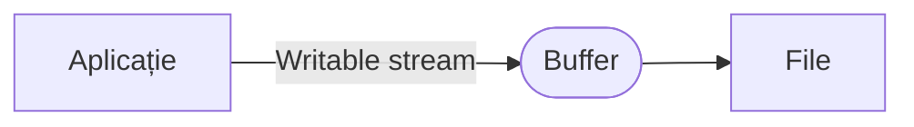

# Clasa `stream.Writable`

Sunt o abstractizare a ceea ce putem înțelege a fi o *destinație*. Sunt stream-urile cu care se pot scrie date, de exemplu. Aceste stream-uri preiau datele de la aplicație și le scriu într-o anumită destinație. Pentru a preveni pierderea datelor în cazul în care destinația nu are capacitatea de procesare care să țină pasul cu volumul datelor, acestea vor fi scrise într-un `Buffer` intern. Aceasta este o zonă de memorie de 16384 bytes care este valoarea lui `highWatermark`. Bufferul este alocat automat. Datele vor fi scrise în Buffer ((*stream.write(data)*)) până când acesta va fi plin. Când Bufferul intern este plin, se va proceda la scrierea respectivelor date. Valoarea datelor care sunt scrise în Buffer-ul intern este ținută în evidență de proprietatea `nume_stream.writableLength`. Când `writableLength` are aceeași valoare cu limita expusă prin valoarea lui `writableHighWaterMark`, atunci se formează un `chunk`, care printr-un callback este prelucrat. Semnalul că `chunk`-ul este pregătit de prelucrare este dat prin apariția evenimentului `data`. Când Node.js emite evenimentul `data`, putem face ceva util cu acel fragment.




Un exemplu simplu. Nu vom scrie codul responsabil cu citirea unui fișier.

```javascript
// PREGĂTEȘTE SCRIEREA FIȘIERULUI
const fileName = 'result.ris';
const fileHandle = await fs.open(fileName, "w");
const streamOutF = fileHandle.createWriteStream();
// record apare ca execuție a listener-ului atașat pe evenimentul `data` la citirea fișierului -> chunk.toString()

// Creezi un Buffer și introduci datele din record
function writeInBuffer () {
    let buff = Buffer.from(record, "utf-8");
    // dacă `write` nu returnează false, ceea ce indică un Buffer full
    if (!streamOutF.write(buff)) {        
        streamOutF.write(buff); // scrie datele în Buffer-ul lui `streamOutF`.
    }
};
// pentru a modera backpressure-ul, se va pune un listener pe `drain` 
streamOutF.on('drain', () => {
    writeInBuffer(); // când Buffer-ul e golit începe să scrii mai multe date
});

streamOut.on('finish', () => {
    fileHandle.close(); // Când se încheie handlerul de fișier, se va încheia automat și stream-ul
});
```

Evenimentul `drain` apare atunci când Buffer-ul intern a fost golit de date. Aceste lucru înseamnă că se pot scrie (*write*) alte date în Buffer. Când stream.write returnează `false` înseamnă că nu Buffer-ul este plin și nu mai poți scrie în el.

Alt exemplu.

```javascript
// read CSV file with a stream
const readStreamCSV = fs.createReadStream(path.resolve(__dirname, 'assets', 'a.csv'));

let sum = 0, unprocessed = '';
readStreamCSV.on('data', (chunk) => {
    let cunkString = unprocessed + chunk.toString(); // convertește Buffer-ul la string
    // TODO: scrie logica pentru prelucrarea liniilor CSV.
})

// write big file on disk with a stream
(async function () {
    const writeStream = fs.createWriteStream(fileName);
    let piece;
    for (piece of arr) {
        // scrie date în buffer până la limita highmark
        const overWatermark = await writeStream.write(piece);
        // dacă ai atins limita oprește execuția până când este golot bufferul, moment când evenimentul drain este emis
        if(!overWatermark) {
            // creează o promisiune care se rezolvă de îndată ce datele au fost scrise pe disk și scoase din buffer. 
            await new Promise((resolve) => {
                writeStream.once('drain', resolve); // când bufferul este gol, este emis evenimentul drain
            });
        }
    }
    writeStream.end();
})();
```

## Cazul cererilor HTTP

Cel mai simplu exemplu de stream `Writable` este un obiect `response`, precum în exemplul de mai jos:

```javascript
const server = require('http').createServer();
server.on('request', function (req, res) {
  res.write('Salut, ');
  res.write('Ionuț!');
  res.end();
});
server.listen(3000);
```

În cazul apelării serverului folosind `curl`, de exemplu, pentru o comandă `curl http://localhost:3000`, răspunsul va fi `Salut, Ionuț`.

## Cum testezi dacă este un stream Writable

```javascript
const isWritableStream = val =>
  val !== null &&
  typeof val === 'object' &&
  typeof val.pipe === 'function' &&
  typeof val._write === 'function' &&
  typeof val._writableState === 'object';

const fs = require('fs');
isWritableStream(fs.createWriteStream('test.txt')); // true
```

## Exemple de stream-uri Writable

Posibilele stream-uri `Writable`:

- HTTP requests, pe partea de client,
- HTTP responses, pe partea de server,
- `fs` - stream-urile *write* (`fs.createWriteStream`),
- stream-uri `zlib`,
- stream-uri `crypto`,
- socket-uri TCP,
- procesele copil `stdin`
- `process.stdout`, `process.stderr`.

Unele dintre aceste stream-uri sunt `Duplex`. Streamurile *Duplex* sunt readable dar și writable. Un exemplu rapid ar fi socketurile de rețea.

```javascript
const fs = require('fs');
const unStream = fs.createWriteStream('./unFisier.txt');
unStream.write('ceva date');
unStream.write('mai adug ceva date');
unStream.end('am terminat de scris datele'); // întotdeauna închide
```

## Evenimentele stream-urilor writable

### Evenimentul `close`

Acest eveniment este emis atunci când stream-ul și resursele sale interne (de exemplu un descriptor de fișier) au fost închise. Aceste eveniment odată emis, marchează faptul că nu vor mai fi emise alte evenimente pentru că alte operațiuni nu vor mai fi făcute.

Dacă un stream va fi creat având setată opțiunea `emitClose`, acesta va emite mereu evenimentul `close`.

### Evenimentul `drain`

Acest eveniment este semnalul că stream-ul writable poate primi date nou din stream. Buffer-ul a fost golot. De exemplu, dacă apelul la `stream.write(chunk)` returnează `false`, evenimentul `drain` va fi emis pentru o posibilă preluare de date noi din stream.

### Evenimentul `error`

Este un eveniment care este emis atunci când a apărut o eroare în timpul scrierii sau introducerii datelor într-un stream.

### Evenimentul `finish`

Evenimentul este emis după apelarea metodei `stream.end()` și după ce toate datele au fost trimise în sistemele din subsidiar care le/le-au consumat. Pur și simplu indică faptul că datele au fost consumate.

```javascript
const streamWriter = genereazaStreamul(); // o funcție care generează un stream
for (let i = 0; i < 100; i++) {
  streamWriter.write(`salut, #${i}!\n`);
}
streamWriter.end('Acesta este finalizarea\n');
streamWriter.on('finish', () => {
  console.log('Au fost scrise toate datele');
});
```

### Evenimentul `pipe`

Acest eveniment este emis la apelarea metodei `stream.pipe()` pe un stream readable, adăugând prezentul writable în setul destinațiilor sale.

```javascript
const writer = genereazaStreamul();
const reader = genereazaStreamul();
writer.on('pipe', (src) => {
  console.log('Ceva este trimis prin piping în writer.');
  assert.equal(src, reader);
});
reader.pipe(writer);
```

### Evenimentul `unpipe`

Acest eveniment este emis la apelarea metodei `stream.unpipe()` este apelat pe un stream `Readable` eliminând `Writeable`-ul prezent din destinații.

```javascript
const writer = genereazaStreamul();
const reader = genereazaStreamul();
writer.on('unpipe', (src) => {
  console.log('S-a oprit ceva în a mai trece spre writer prin piping.');
  assert.equal(src, reader);
});
reader.pipe(writer);
reader.unpipe(writer);
```

## Metodele pentru stream-urile writable

### `writable.cork()`

Această metodă forțează toate datele scrise să fie introduse într-o zonă tampon din memorie. Datele din tampon atunci când va fi apelată, fie `stream.uncork()`, fie `stream.end()`.

Intenția primară a metodei este de a evita situația în care scrierea a mai multor fragmente mici de date într-un stream nu conduce la constituirea unui backup în buffer-ul intern, fapt care conduce la penalizarea performanțelor. În aceste situații, implementările care oferă metoda `writable._writev()` poate executa scrieri buffered într-o manieră optimizată.

### `writable.destroy([error])`

Metoda distruge stream-ul imediat. Opțional, va emite evenimentul `error` și apoi un eveniment `close` cu singura excepție a condiției setată de opțiunea `emitClose` prin `false`. După acest apel, alte apeluri la metodele `write()` sau `end()` vor rezulta într-o eroare `ERR_STREAM_DESTROYED`.

Dacă ai nevoie ca datele să fie epuizate (*flushed*) înainte de a închide stream-ul, mai bine se folosește metoda `end()` sau se va aștepta evenimentul `drain`.

Opțional, poate primi drept argument un obiect `Error`.

Metoda returnează legătura `this`.

### `writable.end([chunk][, encoding][, callback])`

Apelarea metodei semnalează faptul că nu vor mai fi scrise date în `Writable`. Argumentele opționale `chunk` și `encoding` permit scrierea unui ultim fragment de date înaintea închiderii `stream`-ului.

Dacă este nevoie, opțional poate fi adăugat un callback, care să fie executat ca urmare a închiderii scrierii stream-ului. Încercarea de a mai scrie într-un stream după închiderea sa, va rezulta într-o eroare.

```javascript
const fs   = require('fs');
const file = fs.createWriteStream('exemplu.txt');
file.write('salutare, ');
file.end('popor!');// nu mai poți scrie nimic
```

## Resurse

- [Working with Node.js Streams | Poorshad Shaddel](https://medium.com/javascript-in-plain-english/working-with-nodejs-streams-a0d35aca0cc0)
