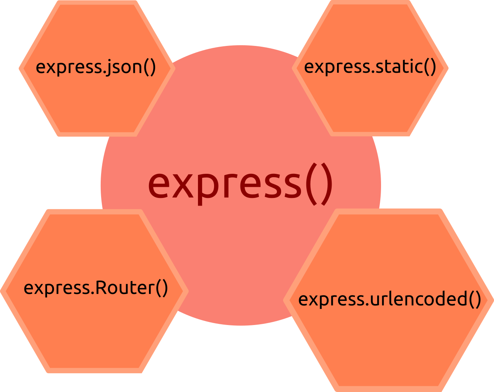

# Express.js

Express este o bibliotecă de cod care în combinație cu Node.js are capacitatea de a servi pagini web și alte resurse. Pe scurt, poți face un server HTTP. Pachetul Express.js poate fi adus de la npmjs.com prin instalarea cu `npm`.

```bash
npm i express
```

Pentru a porni, mai întâi trebuie inițiat constructorul `express` prin cerere și apoi constituirea obiectului denumit generic `app`, care are drept sarcină gestionarea cererilor și a răspunsurilor HTTP pe care modului [http](https://nodejs.org/api/http.html#http_http_methods) al lui Node.js le implementează. Pentru a porni un server HTTP, ai nevoie de cinci linii de cod.

```javascript
const express = require('express');
const app = express(); // generează obiectul aplicație
app.listen('3000', function () {
  console.log('Am pornit serverul pe portul 3000')
});
```

## Obiectul `app`

Obiectul `app` este cel care va gestiona rutele pe care o vor lua cererile. Obiectul `app` este o instanță a clasei `express`. Acest obiect odată instanțiat, oferă metode echivalente metodelor HTTP. De exemplu, pentru a trata o cerere GET, poți folosi metoda `app.get('/produse', nume_callback)`. Prin apelarea lui `express()` vei avea acces la obiectul `app` în fiecare cerere și răspuns (`req.app`).

În acest proces sunt implicate două obiecte foarte importante gestionale la nivel de funcție callback. Unul este dedicat cererii de la client, care se numește generic `request` și celălalt, care va trimite clientului răspunsul, denumit generic `response`. De exemplu, toate rutele definite în aplicația noastră, vor avea o funcție callback, care are drept argumente `req` și `res` (sunt convenții de scriere a identificatorilor celor două obiecte). Callback-ul prelucrează cererea care va fi ambalată în obiectul `req` și va oferi un răspuns ambalat în obiectul `res`. Pentru că este o foarte bună practică să dai nume oricărei funcții, veți întâlni adesea în codul prezentat funcțiile callback purtând un identificator.

```javascript
app.get('/', function clbkRadacina (req, res) {
  // tratează cerea pe prima pagină a site-ului, calea tratată fiind rădăcina.
  res.send("Serverul te salută!");
});
```

În cazul în care dorești să gestionezi toate rutele posibile pentru GET, POST, PUT, DELE, există o metodă destinată acestui scop: `app.all()`.

## Folosirea middleware-ului

Este considerat a fi *middleware* orice funcție care se interpune între obiectul `request` și formarea obiectului `response`. Aceste funcții interpuse au acces la obiectele `request`, `response` și la middleware-ul `next`.


Funcțiile callback cu rol de middleware pot executa cod care să trasforme datele din `req`, poate constitui un răspuns și chiar poate să încheie ciclul cerere-răspuns. În cazul în care funcția middleware nu încheie ciclul prin formularea unui răspuns, trebuie să apeleze `next()` pentru a pasa obiectul cerere modificat de aceasta următorului middleware. Pur și simplu dacă nu trimiți răspunsul din middleware, pasează-l mai departe cu `next()`, alffel, cererea va rămâne în suspensie (`hanged`). O parte din middleware-ul Express.js 3 a fost externalizat în module separate odată cu versiunea 4. Totuși, din tot middleware-ul folosit de Express.js 4, singurul care a fost păstrat intern este cel responsabil de servirea paginilor statice.

```javascript
app.use(express.static(__dirname + '/public'));
```

În Express.js, middleware-ul este *consumat* cu `use()` atunci când dorim ca rutele să fie gestionate prin funcția pasată drept callback. La momentul în care este prelucrată o ceree, mai întâi de toate vor fi executate middleware-urile introduse în lanț cu `use()` și abia după, middleware-ul introdus ca parametru în rută - `app.get('/', numeMidlleware, (req, res, next) => {})`. Toate cererile vor fi procesare de middleware-uri în ordinea în care au fost introduse în fișier.

```javascript
const express = require('express');
const administrator = require('./router/administrator');
const resurse = require('./router/resurse');

const app = express();

app.use(function clbkInainteaTuturor () {
  console.log*'Eu voi rula prima din întregul lanț');
});
app.use('/administrator', administrator);
app.use('/resurse', resurse);
```

Orice middleware (funcție) construit suplimentar, va trebui să se încheie prin apelarea metodei `next()` dacă funcția nu încheie ciclul cerere-răspuns. Această metodă indică faptul că trebuie returnat controlul următorului middleware.

În combinație cu `use()`, un middleware pasat acestei metode, va fi executat pentru fiecare cerere indiferent de cale. Ce este în `use()` va fi executat înainte de orice altă cale care gestionează cererile, dacă este poziționată înaintea acestor rute.

## Metodele obiectului generat de `express()`



Middleware-urile `express.json()` și `express.urlencoded()` sunt necesare pentru a colecta datele trimise de client și pentru a popula proprietatea `req.body` cu acestea.

### express.json([options])

Acesta este un middleware construit intern în Express. Acest middleware se bazează pe modulul [body-parser](http://expressjs.com/en/resources/middleware/body-parser.html).

## Referințe

- [Anatomy of an HTTP Transaction | Node.js](https://nodejs.org/en/docs/guides/anatomy-of-an-http-transaction/)
