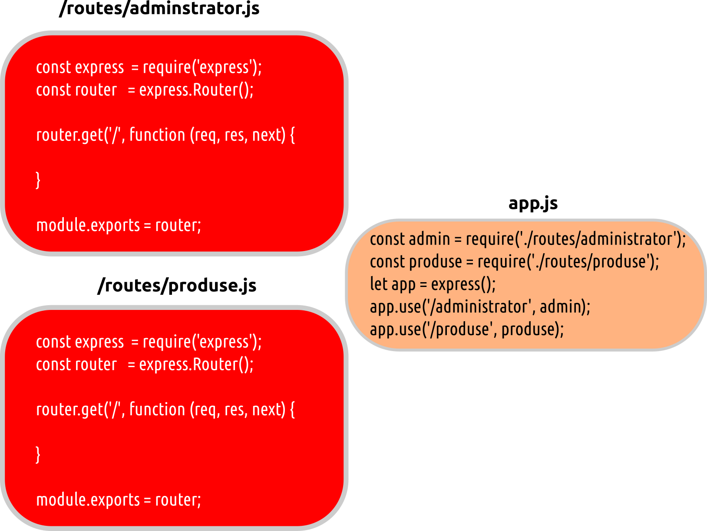

# `express.Router()`

Această clasă este folosită pentru a crea gestionari de rute modulari și care pot fi atașabili. O instanță `Router` este un middleware complet care asigură rutatea.
[Semnătura](https://expressjs.com/en/api.html#express.router): `express.Router([options])`.

Se comportă ca o miniaplicație care rulează în izolare. Obiectul `express` are o metodă care permite instanțierea de rutere. Poți seta rute pe această aplicație, apelând o instanță a acesteia și apoi să definind rute pe aceea. Rutarea este foarte utilă pentru compartimentarea aplicațiilor complexe.

Un posibil scenariu implică următorii pași:

1. cheamă o instanță a ruterului
2. adaugă rute la aceasta
3. adaugă aceste rute la aplicația principală

```javascript
// obține o instanța routerului
var adminRouter = express.Router();

// adaugă o rută pe `/administrator`
adminRouter.get('/', function (req, res) {
  res.send('sunt locul in care trebuia sa fii');
});

// adaugă o rută pe `/administrator/utilizatori`
adminRouter.get('/users', function (req, res) {
  res.send('Arat care sunt utilizatorii');
});

// adaugă o rută spre `/administrator/posts`
adminRouter.get('/posts', function (req, res) {
  res.send('Arat postarile');
});

//adaug rutele la aplicatie
app.add('/administrator', adminRouter);
```

Trebuie reținut faptul că putem avea oricâte routere avem nevoie. Pentru fiecare zonă a aplicației putem avea un router diferit. Acest lucru este posibil pentru că un router se comportă ca un middleware în sine. Toate aceste rutere pot fi adăugate aplicației pasând referința către miniaplicație într-un `app.use('/', numeMiniAppCuRouter)`.

## Obiectul router

Un obiect `router` este o instanță izolată de middleware și rute. Un router se comportă ca un middleware și poate fi folosit ca argument la `app.use(nume_router)` sau ca argument la oricare caz de utilizare a metodei `use()`. Obiectul `express` are o metodă `Router()` care permite instanțierea unui obiect router.

Un obiect router, în afară de tratarea rutelor, poate implementa propriile middleware-uri pentru că are metoda `use()`.

```javascript
// invocat pentru fiecare cerere pasată pe acest ruter
router.use(function (req, res, next) {
  // logica middleware-ului
  next();
});
```

### Metoda router.all

Această metodă se comportă precum oricare altă metodă `router.METHOD()` cu diferența că va prelucra cererile de pe toate verbele HTTP.
Semnătura: `router.all(path, [callback, ...] callback)`.

Metoda este foarte utilă pentru cazuri în care, de exemplu, este necesară autentificarea pentru a lucra pe endpoint-urile gestionate de acel ruter.

```javascript
router.all('*', requireAuthentication, loadUser);
// sau în etape, dacă acest lucru este util
router.all('*', requireAuthentication)
router.all('*', loadUser)
```

Poți privi această metodă ca o funcționalitate la nivelul global al mini-aplicației realizată cu `router`. De exemplu, mai jos avem o restricționare doar la căile prefixate cu `/api`.

```javascript
router.all('/api/*', requireAuthentication);
```

### Metoda definită de însuși verbul

Metoda `router.METHOD()` oferă funcționalitatea legată de însăși rutarea în sine. Ficeare verb HTTP are o metodă echivalentă.
Semnătura: `router.METHOD(path, [callback, ...] callback)`.

Funcția cu rol de callback pentru `router.get()` este apelată automat pentru metoda `head` din oficiu dacă `router.head()` nu a fost apelat pentru respectiva cale înaintea lui `router.get()`.

Poți introduce mai multe funcții cu rol de callback, care vor fi aplicate pe obiectul cerere fără diferențe, toate acestea comportându-se precum niște middleware-uri. În cazul în care într-unul dintre callback-uri dorești să nu mai fie apelare și restul callback-urilor, vei apela `next('ruta')` pentru a le sări, pur și simplu. Poți folosi acest mecanim pentru a verifica niște condiții inițiale.

### Parametrii rutelor

Metoda înregistrează un callback pentru un anumit parametru care poate fi în apel. Spre deosebire de `app.param()`, `router.param()` nu acceptă un array de parametri.
Semnătura: `router.param(name, callback)`.

De exemplu, dacă `:user` este prezent între parametrii unei căi, ai putea crea logica pentru validarea unui user sau pentru a returna `req.user`.

```javascript
router.param('user', function (req, res, next, id) {
  // Obșine detaliile userului dintr-un model (MongoDB) și atașează-l obiectului request
  User.find(id, function (err, user) {
    if (err) {
      next(err)
    } else if (user) {
      req.user = user;
      next();
    } else {
      next(new Error('failed to load user'));
    }
  })
})
```

Funcțiile callback pentru parametru sunt locale routerului respectiv. Acestea nu sunt moștenite de aplicații montate sau de routere.

Un callback asociat unui anumit parametru, va fi apelat o singură dată într-un ciclul cerere-răspuns chiar dacă respectivul parametru este tratat și în alte rute definite.

```javascript
router.param('id', function (req, res, next, id) {
  console.log('Callback apelat o singură dată');
  next();
})

router.get('/user/:id', function (req, res, next) {
  console.log('Sunt apelat');
  next();
})

router.get('/user/:id', function (req, res) {
  console.log('chiar dacă se potrivește și asta');
  res.end();
})
```

### Metoda router.route(path)

Această metodă returnează instanța unei singure rute care poate fi folosită pentru a gestiona verbe HTTP folosind middleware opțional. De regulă, vei folosi această metodă pentru a evita nume duplicate de rută sau scrierea lor eronată.

```javascript
var router = express.Router();

router.param('user_id', function (req, res, next, id) {
  // mostră de user, posibil adus din baza de date
  req.user = {
    id: id,
    name: 'TJ'
  }
  next();
})

router.route('/users/:user_id')
  .all(function (req, res, next) {
    // rulează pentru toate verbele
    // te poți gândi că este un middleware specific pentru o rută
    next();
  })
  .get(function (req, res, next) {
    res.json(req.user);
  })
  .put(function (req, res, next) {
    // un exemplu de posibilă actualizare a unui user
    req.user.name = req.params.name
    // salvare user, etc.
    res.json(req.user);
  })
  .post(function (req, res, next) {
    next(new Error('neimplementat'));
  })
  .delete(function (req, res, next) {
    next(new Error('neimplementat'));
  })
```

### Metoda router.use()

Metoda folosește callback-ul sau callback-urile pentru a prelucra apelurile de pe o anumită rută. Dacă nu este menționată nicio rută, valoarea din oficiu este rădăcina (`/`). Această metodă este similară lui app.use().
Semnătura: `router.use([path], [function, ...] function)`.

```javascript
var express = require('express');
var app     = express();
var router  = express.Router();

// logger simplu pentru cererile de pe acest router
// toate cererile pe acest router vor fi gestionate mai întâi de acest middleware
router.use(function (req, res, next) {
  console.log('%s %s %s', req.method, req.url, req.path);
  next();
});

// acesta va fi invocat doar dacă, calea începe cu /bar începând de la punctul de montare
router.use('/bar', function (req, res, next) {
  // ... ceva loggins suplimentar pe /bar
  next();
});

// este mereu invocat
router.use(function (req, res, next) {
  res.send('Salut, popor');
})

app.use('/foo', router);

app.listen(3000);
```

Middleware-ul se comportă precum segmentele unei instalații. Cererea ajunge pe primul middleware, urmează următorul ș.a.m.d. Calea, adică șirul de caractere al căii, nu este vizibil pentru funcția cu rol de callback.

Ordinea pe care o definești cu `router.use()` este foarte importantă pentru că funcțiile cu rol de middleware vor fi apelate în ordinea definirii middleware-ului.

```javascript
var logger = require('morgan');
var path   = require('path');

router.use(logger());
router.use(express.static(path.join(__dirname, 'public')));
router.use(function (req, res) {
  res.send('Hello');
});
```

În exemplul oferit de documentație, middleware-ul care face logging este poziționat primul cu scopul de a loga toate cererile înainte de a fi prelucrate. În cazul în care vei dori să vezi doar cererile care nu sunt pentru fișierele fixe, vei poziționa logger-ul mai jos, sub `express.static`, de exemplu.

Un alt exemplu este cel al setării de mai multe directoare din care servești resurse statice.

```javascript
router.use(express.static(path.join(__dirname, 'public')));
router.use(express.static(path.join(__dirname, 'files')));
router.use(express.static(path.join(__dirname, 'uploads')));
```

Metoda `use()` poate primi și căi cu parametri (*named parameters*) și astfel, punctele de montare pentru alte rutepot beneficia de preîncărcare folosind *named parameters*.

Atenție, chiar dacă funcțiile cu rol de middleware sunt adăugate folosindu-se un anumit router, atunci când sunt rulate, sunt rulate pe calea pentru care sunt atașate. Acest lucru înseamnă că middleware-ul atașat folosind un router, va fi folosit și de alte routere, dacă rutele se potrivesc. Pentru a evita acest comportament, folosește căi diferite pentru fiecare router.

## Ordinea rutelor

Ordinea în care pui middleware-ul este foarte importantă. Cererile vor fi prelucrate în funcție de lanțul de prelucrare pe care îl creezi.

De exemplu, dacă ai următoarele posibile rute:

```javascript
let router = express.Router();

router.get('/', functieDePrelucrareACererii);
router.get('/carti', functieDePrelucrareACererii);
router.get('/carti/:idCarte', functieDePrelucrareACererii);
router.get('/carti/delete', functieDePrelucrareACererii);
```

În exemplul de mai sus, dacă am poziționat ruta care are o parte variabilă marcată prin două puncte înaintea altor rute cu acelați prefix, în cazul nostru `/carti/`, lanțul de prelucrare se va opri la acest middleware cu două puncte pentru că următoarea cale `/carti/delete` va fi prelucrată de `/carti/:idCarte`, ceea ce înseamnă că nu va mai ajunge niciodată pe `/carti/delete`.
Reține faptul că modul în care ordonezi căile, indică cine va prelucra cererea. În exemplul dat, pentru a ajunge la `/carti/delete`, va trebui să punem această cale înaintea celei care are partea variabilă.

```javascript
let router = express.Router();

router.get('/', functieDePrelucrareACererii);
router.get('/carti', functieDePrelucrareACererii);
router.get('/carti/delete', functieDePrelucrareACererii);
router.get('/carti/:idCarte', functieDePrelucrareACererii);
```

Numele părții variabile va fi o cheie a obiectului `req.params`.

## Rute simple

### Rută simplă pentru homepage

```js
app.get('/', function(req, res) {
  res.send('Welcome to the home page!');
});
```

## Instanțiază un router

```js
const express = require('express');
const router = express.Router();
```

În cazul în care rutele sunt definite într-un fișier separat, nu uita ca în fișierul respectiv, după ce ai definit middleware pentru toate verbele, să exporți routerul pentru ca atunci când este importat acolo unde se face montajul, să fie instanțiată miniaplicația ruterului respectiv.

```javascript
// `/app.js`
const express = require('express');
const app     = express();
const morgan  = require('morgan');

app.use(morgan('combined'));

app.get('/', function (req, res) {
  res.send("Salut");
});

// Rutări
let apit1 = require('./routes/apit1');
app.use('/api/test1', apit1);

app.listen('3000', () => console.log('Pe 3000'));

// `/routes/apit1.js`

const express = require('express');
const router = express.Router();

router.route('/')
  .all(function clbkAllApit1(req, res, next) {
    console.log("Eu mă execut pentru orice pe /api/apit1");
    next();
  })
  .get(function clbkGetApit1 (req, res, next) {
    res.send("Bine ai venit, veveriță!");
  });

module.exports = router; // Nu uita!!!
```

### O rută de text

```js
apiRouter.get('/', function(req, res) {
  res.json({ message: 'hooray! welcome to our api!' });
});
```

După ce ai scris toate rutele aici trebuie să folosești routerul sau routerele, dacă sunt mai multe cu middleware-ul Express.js.

```js
app.use('/api', apiRouter);
```

## Rute gestionate pe orizontală

Atunci când ai de gestionat o întreagă aplicație cu mai multe căi, devine nepractic să folosești un singur fișier care să gestioneze toate căile. Din acest motiv, poți sparge gestionarea căilor în mai multe fișiere pe care să le pui într-un director generic `/routes`. În acest director, creezi câte un fișier pentru fiecare din ramificațiile principale ale aplicației.



## Metoda `route.use()`

Cu ajutorul metodei `use()` se realizează atașarea de middleware specific unei rute.

```javascript
var express = require('express');
var router  = express.Router();

// middleware specific rutei prezente
router.use(function timeLog (req, res, next) {
  console.log('Data și ora: ', Date.now());
  next();
})
// calea rădăcină pe ruta servită de acest fișier
router.get('/', function (req, res) {
  res.send('Ceva de pe ruta asta');
})

module.exports = router;
```

## Resurse

- [Obiectul router](https://expressjs.com/en/api.html#router)
