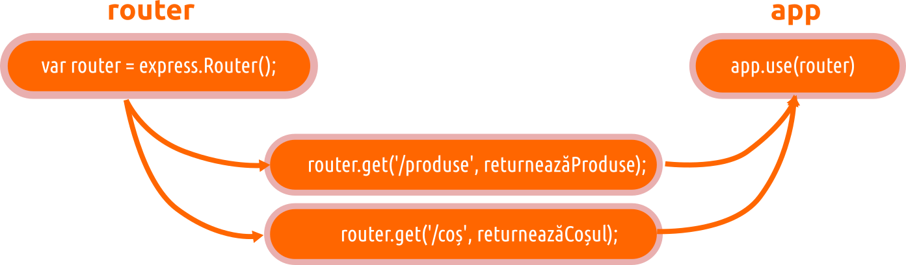
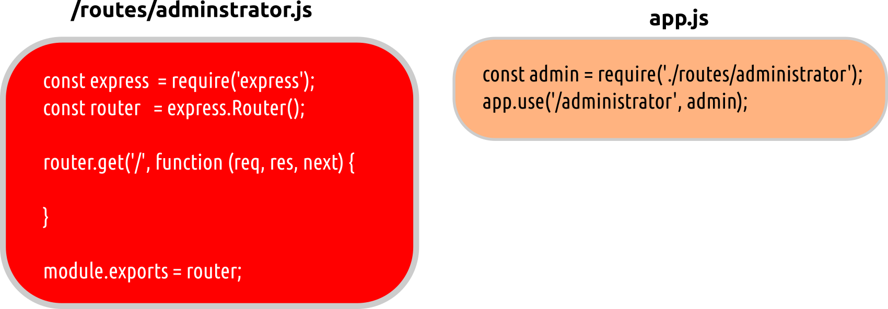

# Rutarea

Un apel către serverul motorizat de Express, va conține o cale de la care agentul așteaptă o resursă. Express, are nevoie de un gestionar de rute, care să poată gestiona solicitarea. O rută se mai numește **endpoint**. Trebuie precizat faptul că o aplicație Express odată pornită, va asculta toate apelurile. Fiecare cerere venită la server va fi tratată conform unui lanț de middleware și rute definite.

Rutarea se face folosind metodele obiectului `app` care corespund verbelor/[metodelor HTTP](https://expressjs.com/en/4x/api.html#app.METHOD): `app.get()`, `app.post()` ș.a.m.d. Poți folosi `app.all()` pentru a gestiona toate metodele HTTP și `app.use()` pentru a specifica middleware-uri materializate prin funcții cu rol de callback. Putem spune că o funcție pasată unui `app.use()` se va comporta în sine ca un ruter.

O metodă de rutare poate avea mai multe funcții cu rol de callback ([middleware](https://expressjs.com/en/guide/using-middleware.html)), care vor trata în cascadă cererea HTTP.

Dacă în cazul setării aplicației Express am folosit funcția specială `app.set()`, pentru a realiza rutarea, se va folosi funcția de extragere a unei valori din obiectul Express. Aceasta va primi doi parametri. Primul este calea pe care ruterul va asculta solicitările, iar al doilea este o funcție anonimă cu rol de callback construită de noi pentru a gestiona răspunsul. Această funcție este numită **request handler**.

```javascript
app.get('/', function (req, res) {
  res.send('Salut prietene!');
});
```

Funcția callback va primi două obiecte drept argumente. Unul este cel care reflectă ceea ce s-a obținut în urma solicitării făcută pe calea specificată și este numit, de regulă `req` (de la *request*), iar celălalt este `res` (de la *response*), care este obiectul cu ajutorul căruia se va construi răspunsul către agent.

Răspunsul este configurabil în cele mai mici amănunte.

```javascript
app.get('/test/:nume', function (req, res) {
  res.status(200);
  res.set('Content-type', 'text/html');
  res.send('<html lang="ro"><head><title>Bau!</title></head><body>' + req.params.nume + '</body></html>');
});
```

## Rutarea folosind `express.Router()`

Middleware-ul la nivelul rutării lucrează în același fel precum cel folosit în aplicație, dar toate solicitările vor fi direcționate către o instanță `Router` pe care o realizăm învocând metoda cu același nume pe care instanța `express` o pune la dispoziție.

```javascript
var router = express.Router();
```

Cel mai simplu scenariu de lucru ar fi precum cel din următoarea imagine.



Router-ul strălucește atunci când este folosit pentru a gestiona rutele pe o anumită rădăcină. Să presupunem că dorim să gestionăm toate căile care încep cu o anumită rădăcină. Pentru a face acest lucru, vom seta un fișier de gestiune a căilor pe care îl vom exporta și apoi instanția în locul în care le vom atașa rădăcinii.



### Gestionarea segmentelor dinamice

Segmentele dinamice ale unei rute sunt semnalizate prin apariția în calea menționată a două puncte urmate de un identificator.

Să presupunem că avem o rută dinamică `/resurse/:id`. Acesta va fi în adresa browserului ceva asemănător cu următoarea adresă: `https://www.sitepropriu.ro/resurse/432jk423342k432`. Din adresa noastră, ultimul segment, este identificatorul unei resurse. Acest identificator va fi disponibil prin `req.params.id` a obiectului `req` disponibil funcției cu rol de callback.

## Referințe

- [Express. Using middleware](https://expressjs.com/en/guide/using-middleware.html)
