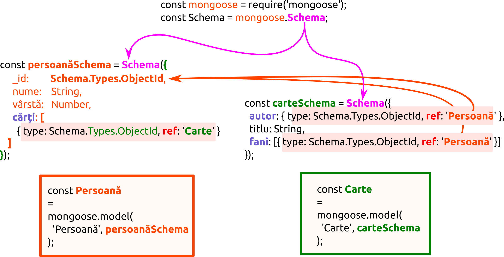

# Populate

Pentru a înțelege metoda [populate()](https://mongoosejs.com/docs/api.html#model_Model.populate) trebuie să înțelegem că este răspunsul Mongoose la operatorul de agregare al MongoDB [$lookup](https://docs.mongodb.com/manual/reference/operator/aggregation/lookup/). Documentația MongoDB aduce câteva lămuriri necesare pentru a înțelege modul de operare a lui `populate()`.

> Face un **left outer join** pe o colecție `unsharded`, care este în *aceeași* bază de date pentru a căuta în documentele din colecția constituită (*joined*), care va fi supusă procesării. Pentru fiecare document care intră în faza de `$lookup` se adaugă un nou câmp de array al cărui elemente sunt documentele care s-au potrivit criteriilor aflate în colecția *joined*. Faza `$lookup` pasează aceste documente remodelate către etapa următoare (lookup | docs.mongodb.com)[https://docs.mongodb.com/manual/reference/operator/aggregation/lookup/].

Definiția lui `populate()` din documentația originală:

> Populate este procesul prin care se înlocuiesc automat căile specificate în document cu documentele aflate în alte colecții.

Este posibilă popularea unui singur document, a mai multor documente, a unor simple obiecte, a mai multor obiecte simple sau a tuturor obiectelor care au fost returnate ca urmare a unei interogări.

Documentele returnate atunci când se face popularea, pot fi `remove`able, `save`able, cu singura mențiune că nu trebuie să fie specificată opțiunea `lean`. Documentele returnate nu trebuie confundate niciun moment cu sub-documentele. Pentru că atunci când se face o operațiune de ștergere, aceasta se va răsfrânge direct asupra bazei de date, fii foarte atentă cu `remove` în scenariul `populate`. Pentru mai multe detalii privind metoda în sine, citește și documentația de la `Query.prototype.populate()`. Un detaliu tehnic important este acela că `Document#populate()` și `Query#populate()` folosesc de fapt metoda `Model#populate()`. 

```javascript
const mongoose = require('mongoose');
const Schema = mongoose.Schema;

const persoanăSchema = Schema({
  _id: Schema.Types.ObjectId,
  nume: String,
  vârstă: Number,
  cărți: [{
    type: Schema.Types.ObjectId,
    ref: 'Carte'
  }]
});

const carteSchema = Schema({
  autor: {
    type: Schema.Types.ObjectId,
    ref: 'Persoană'
  },
  titlu: String,
  fani: [{
    persoana: {type: Schema.Types.ObjectId, ref: 'Persoană'},
    impresie: String
  }]
});

const Carte = mongoose.model('Carte', carteSchema);
const Persoană = mongoose.model('Persoană', persoanăSchema);
```

În exemplul dat, o persoană poate scrie mai multe povești. Opțiunea `ref` îi spune lui Mongoose, care este colecția din care vor proveni documentele la momentul populării. În cazul nostru este schema `persoanăSchema`.



Id-urile care vor fi culese, trebuie să fie id-uri de documente (`_id`) din modelul de `Carte`.

Atenție, `ref`-urile pot primi următoarele valori: `ObjectId`-uri, `Number`, `String` sau `Buffer`.

## Salvarea documentelor în baza proprie odată cu salvarea părintelui

Atunci când este nevoie, poți salva `ref`-uri către documente care mai târziu vor fi populate pentru documentul părinte, poți face asta folosind hook-ul `save()`. Pur și simplu trebuie să atribui valoarea `_id`-ul părintelui în câmpul care joacă rolul unui foreign key.

```javascript
const autor = new Persoană({
  _id:    new mongoose.Types.ObjectId(),
  nume:   'Ian Fleming',
  vârstă: 50
});

autor.save(function (err) {
  if (err) throw err;
  // salvează autorul cu o primă operă a sa:
  const carte1 = new Carte({
    titlu: 'Casino Royale',
    autor: autor._id    // atribuie _id din modelul Persoană
  });

  carte1.save(function (err) {
    if (err) throw err;
    // am salvat cartea si apoi autorul
  });
});
```

Ceea ce am realizat este salvarea unui autor cu o primă operă/carte a sa dintr-o singură mișcare.

## Popularea unui singur câmp cu date

Scenariul este următorul: ai nevoie să afișezi datele unei cărți. O carte poate fi scrisă de o singură persoană sau de mai multe. Anterior am introdus un singur autor cu o singură operă. Să inițiem popularea câmpului `autor` cu datele ce reprezintă cărțile sale. Pentru că anterior am introdus doar una, datele acesteia vor popula câmpul `autor` al înregistrării de tip carte pentru un titlu ales.

```javascript
Carte.
  findOne({ titlu: 'Casino Royale' })
    .populate('autor')
    .exec(function (err, carte) {
      if (err) throw err;
      console.log('Autorul este %s', carte.autor.nume);
      // afișează "Autorul este Ian Fleming"
    });
```

În baza de date, în câmpul `autor` avem un array de id-uri ale autorilor care au scris opera. În momentul în care facem interogarea, în cazul nostru o carte, acele id-uri ale autorilor vor fi înlocuite cu documentele care sunt tot atâția autori. În exemplul de mai sus a fost folosită metoda `exec()` pentru a afișa punctual datele.

În callback-ul lui `exec`, dacă o carte are mai mulți autori, va fi disponibil un array `carte.autor` care va cuprinde toți autorii (adică documente `Persoană`). În cazul în care avem un singur autor, obiectul său va fi disponibil pe calea `carte.autor`.

În cazul modelului explorat, am putea popula și câmpul `fani` pentru că este posibilă imbricarea apelurilor `populate()`.

```javascript
Carte.findOne({titlu: 'Casino Royale'})
  .populate({
    path: 'autor',
    populate: {
      path: 'fani.persoana'
    }
  })
  .exec(function (error, carte) {
    if (error) throw error;
    // Aici ai la dispoziție carte.autor.fani.persona
  });
```

## Popularea mai multor câmpuri deodată

Pentru a popula mai multe câmpuri deodată, se va apela metoda `populate` pentru fiecare din câmpuri.

```javascript
Carte.
  findOne({ titlu: 'Casino Royale' }).
  populate('autor').
  populate('fani').
  exec(function (err, carte) {
    if (err) throw err;
    console.log('Fanii sunt %s', carte.fani.nume);
    // afișează toate înregistrările de persoane pentru care câmpul fani are id-uri.
  });
```

În cazul în care, din eroare, faci o populare de mai multe ori pe aceeași cale, doar ultima va fi luată în considerare.

```javascript
Carte.
  findOne({ titlu: 'Casino Royale' })
    .populate({path: 'fani', select: 'nume'})
    .populate({path: 'fani', select: 'vârstă'})
    .exec(function (err, carte) {
      if (err) throw err;
      console.log('Fanii sunt %s', carte.fani.nume);
      // afișează toate întregistrările de persoane pentru care câmpul fani are id-uri.
    });
  // Fiind echivalent cu:
  Carte.find().populate({ path: 'fani', select: 'vârstă' });
```

## Setarea explicită a câmpurilor pentru populare

O proprietate poate fi populată manual prin setarea sa cu un document. Documentul trebuie să fie o instanță a modelului la care proprietatea `ref` menționată în model se referă. În cazul în care un anumit scenariu o cere, se poate atribui explicit valoarea câmpului ce va fi populat.

```javascript
Carte.findOne({ titlu: 'Casino Royale' }, function (error, carte) {
  if (error) {
    console.log(error);
  }
  carte.autor = autor;
  console.log(carte.autor.nume); // afișează "Ian Fleming"
});
```

## Documentul corespondent nu există

În cazul în care nu avem un document corespondent din care proprietatea `ref` să poată aduce date, rezultatul `ref` va fi `null`. Este același comportament ca al unui LEFT OUTER JOIN.

```javascript
await Persoană.deleteMany({ nume: 'Ian Fleming' });

const poveste = await Carte.findOne({ titlu: 'Casino Royale' }).populate('autor');
carte.autor; // `null`
```

În cazul în care în `carteSchema` ai avut un array de autori, `populate`, va returna un array gol.

## Selectarea câtorva câmpuri, nu a întregii întregistrări

În cazul în care dorești să aduci doar câteva câmpuri din întreaga întregistrare care vor popula câmpul, acestea pot fi menționate ca argumente metodei `populate()`.

```javascript
Carte.
  findOne({ titlu: /casino royale/i }).
  populate('autor', 'nume'). // doar valoarea câmpului nume va fi adusă
  exec(function (err, carte) {
    if (err) throw err;

    console.log('Autorul este %s', carte.autor.nume);
    // afișează "Autorul este Ian Fleming"

    console.log('Vârsta autorului este %s', carte.autor.vârstă);
    // afișează "Vârsta autorului este null'
  });
```

## Popularea mai multor căi deodată

În cazul în care dorești popularea mai multor căi, acest lucru este posibil apelând repetat în lanț a metodei.

```javascript
Carte.find({ titlu: 'Casino Royale' })
  .populate('fans')
  .populate('author')
  .exec();
```

## Popularea cu anumite condiții - `match`

Uneori dorești să faci o alegere a unor date cu care se va face popularea în funcție de anumite criterii. În exemplul de mai jos, vom aduce toate cărțile ale căror fani au vârsta peste 21 de ani.

```javascript
Carte.find({ titlu: 'Casino Royale' })
  .populate({
    path: 'fani',
    match: { vârstă: { $gte: 18 }},
    // Excluzi `_id` în mod explicit, vezi http://bit.ly/2aEfTdB
    select: 'nume -_id',
    options: { limit: 5 }
  }).
  exec();
```

În cazul în care nu sunt satisfăcute criteriile de la `match`, array-ul `fani` va fi gol.

## limit vs. perDocumentLimit

Funcția `populate` are o opțiune numită `limit`. În cazul următor

```javascript
Carte.create([
  { title: 'Casino Royale', fani: [1, 2, 3, 4, 5, 6, 7, 8] },
  { title: 'Live and Let Die', fani: [9, 10] }
]);
```
dacă se va opta pentru o limită setată la 2, vei remarca că cea de-a doua carte nu returnează niciun fan.

```javascript
const stories = await Carte.find().populate({
  path: 'fani',
  options: { limit: 2 }
});

stories[0].name; // 'Casino Royale'
stories[0].fani.length; // 2

// 0 fani!
stories[1].name; // 'Live and Let Die'
stories[1].fani.length; // 0
```

Acest lucru se întâmplă pentru că Mongoose evită să execute câte un query individual pentru fiecare document și face o interogare a cărei limită este produsul dintre numărul de documente și limita menționată.

Pentru a corecta acest comportament ar trebui să setezi limita folosind `perDocumentLimit`. Acesta va avea drept efect interogarea pentru fiecare document distinct din colecție care are cel puțin numărul specificat.

```javascript
const stories = await Carte.find().populate({
  path: 'fani',
  perDocumentLimit: 2
});

stories[0].name; // 'Casino Royale'
stories[0].fani.length; // 2

stories[1].name; // 'Live and Let Die'
stories[1].fani.length; // 2
```

## Eliminarea înregistrărilor folosind `virtual()` și `match()`

Să presupunem că o anumită resursă are mai multe comentarii. Unele dintre acestea sunt șterse de administrator. Pentru a filtra documentele comentariu care au setat un boolean ce indică ștergerea, ne putem ajuta de un posibil model, care folosește o zonă de documente găsite ca tampon de date implicând `virtual()`.

Un virtual este un câmp virtual al unei scheme Mongoose care nu va fi salvat în baza de date.

```javascript
// Creează schema resursei
const resursaSchema = new mongoose.Schema({
  titlu:   String,
  autorId: Number
});

// creează virtualul
resursaSchema.virtual('comentarii', {
  ref:        'Comentariu',
  localField: '_id',
  foreignField: 'resursaId',
  // În momentul în care populezi comentariile, exclude-le pe cele care au fost șterse`; sters este setat la `true`
  options: { match: { sters: { $ne: true } } }
});

const comentariuSchema = new mongoose.Schema({
  _id:       Number,
  resursaId: {type: mongoose.schema.Types.ObjectId, ref: 'Resursa'},
  authrId:   Number,
  sters:     Boolean
});

const Resursa = mongoose.model('Resursa', resursaSchema);
const Comentariu = mongoose.model('Comentariu', comentariuSchema);
```

În materialul dedicat metodei `match()` este detaliat modul în care poți combina `populate` cu `match` pentru a aduce rezultate.

```javascript
const authorId = 1
post = await BlogPost.find().populate({
  path: 'comments',
  match: doc => (doc.authorId === authorId ? {} : { deleted: { $ne: true } })
}); // după Valeri Karpov - vezi Aggregate.prototype.match
```

## Cum facem legăturile între colecții

Există posibilitatea ca atunci când folosim obiectul `autor`, să descoperim că nu se populează lista cărților. Acest lucru este pentru că încă nu au fost introduse obiecte `carte` în `autor.carti` pentru că pur și simplu acestea nu există.

Aici există două abordări:

- Te asiguri că id-ul `autor`-ul există în cel puțin o carte. De regulă schema ar trebui să rezolve relații de tipul one-to-many prin existența unui pointer către părinte în zona de many (în cazul nostru o înregistrare carte să aibă id-ul autorului).
- dacă există un motiv întemeiat să constitui un array de pointeri către documentele copil (carti), poți face `push()` documentelor în array precum în următorul exemplu:

```javascript
// salvezi o carte pentru care reții id-ul
primaCarte.save();

// apoi în documentul autor, în array-ul câmpului 
// cărți faci push la id-ul cărții `primaCarte`
autor.carti.push(primaCarte);
autor.save(callback);
```

Acest mod permite o combinație de căutare cu populare într-o singură operațiune.

```javascript
Persoana.
  findOne({ nume: 'Ian Fleming' }).
  populate('carti'). // merge doar dacă am făcut push la ref-uri în colecția carti care are autorul
  exec(function (err, persoana) {
    if (err) return handleError(err);
    console.log(persoana);
  });
```

În cazul în care setăm pointeri și în `Persoana` către `Carte`, dar și în `Carte` către `Persoana`, fie o parte, fie cealaltă se va desincroniza, adică va trebui să găsim o cale prin care ambele colecții să fie actualizate cu id-ul. 

Soluția propusă ar fi ca în loc de populate, să se facă un `find()` pe cărți în loc de populate pe autor.

```javascript
Carte.
  find({ autor: autor._id }).
  exec(function (err, carti) {
    if (err) throw err;
    console.log('Cărțile sunt un array ce conține: ', carti);
  });
```

Un avantaj major al acestei abordări din urmă este acela al obținerii unor documente live, funcționale pe care se pot performa acțiuni cu excepția cazului în care s-a optat pentru returnarea unor documente `lean`. O ultimă precizare este ca acestea să nu fie confundate cu subdocumentele.

## Popularea unui document pe care l-ai obținut deja

În cazul în care deja au un document și dorești să populezi unele căi ale sale, vei folosi metoda `populate()`, pe care `Document` o pune la dispoziție. Pentru mai multe detalii utile, vezi documentația pentru `Document.prototype.populate()`.

```javascript
// mai întâi obții documentul Mongoose
const person = await Persoana.findOne({ name: 'Ian Fleming' });

// dacă verifici cazul în care popularea s-a făcut deja:
person.populated('carti'); // rezultatul este `null`

// mai întâi aplici metoda `populate` pe care `Document` o pune la dispoziție
await person.populate('carti');

// cand verifici din nou, documentul va fi populat, rezultatul fiind un array de ObjectId-uri
person.populated('carti');
person.carti[0].titlu = "Casino Royale";
```

Documentația spune că `Document#populate()` nu acceptă chaining-ul, fiind necesară apelarea metodei `populate()` de mai multe ori sau pe un array de căi (paths) pentru a le popula pe toate.

```javascript
await person.populate(['carti', 'fani']);
person.populated('fani'); // Array de ObjectId-uri
```

## Popularea unui model

Pentru a face experimentele mai simple, mai întâi vom crea două colecții introducându-le și referințele necesare.

```javascript
const mongoose = require('mongoose');
// MONGOOSE - Conectare la MongoDB
mongoose.set('useCreateIndex', true); // Deprecation warning
mongoose.connect('mongodb://localhost:27017/lucru', {useNewUrlParser: true, useUnifiedTopology: true}).catch(error => {
    if (error) throw error;
});

var Schema = mongoose.Schema;

// 2 models: Book and Author
var bookSchema = new Schema({
    title: String,
    author: {
        type: mongoose.ObjectId,
        ref: 'Author'
    }
});
var Book = mongoose.model('Book', bookSchema);

var authorSchema = new Schema({
    name: String
});

var Author = mongoose.model('Author', authorSchema);

// Creează cărțile cu autorii lor
var arr = [
    { name: 'Michael Crichton' },
    { name: 'Ian Fleming' }
];

Author.create(arr, (err, a) => {
    if (err) throw err;
    const [author1, author2] = a;
    var arr2 = [
        { title: 'Jurassic Park', author: author1._id },
        { title: 'Casino Royale', author: author2._id }
    ];
    Book.create(arr2, (err, b) => {
        if (err) throw err;
    });
});
```

În momentul în care facem popularea, vom obține un rezultat foarte interesant în sensul în care vor fi aduse și înregistrările `null` precum în cazul unui **LEFT OUTER JOIN**.

```javascript
Book.find().populate({
    path: 'author',
    match: { name: 'Ian Fleming' }
}).exec(function (err, books) {
    if (err) return handleError(err);
    books.forEach((book) => {
        console.log(book);
    });
});
/*
{
  _id: 5da42cba5edea641e4813518,
  title: 'Jurassic Park',
  author: null,
  __v: 0
}
{
  _id: 5da42cba5edea641e4813519,
  title: 'Casino Royale',
  author: { _id: 5da42cba5edea641e4813517, name: 'Ian Fleming', __v: 0 },
  __v: 0
}
*/
```

Este observabil faptul că în afară de înregistrarea care este utilă, mai este adusă una a cărui date de la câmpul `author` este `null`. De fapt, vor fi aduse multe alte documente pe lângă cel de interes pentru că în spate, ceea ce se petrece, este o operațiune în două faze:

1. Mai întâi se face o căutare globală cu

```javascript
Book.find().populate({})
```

2. Apoi se filtrează folosind un scenariu de tipul:

```javascript
Author.find({ _id: { $in: books.map(b => b.author) }, name: 'Ian Fleming' })
```

Pentru a filtra eficient, totuși calea corectă este de a introduce numele autorului în înregistrarea de carte.

```javascript
// avem două modele: Book și Author
const Book = mongoose.model('Book', Schema({
  title: String,
  author: {
    type: mongoose.ObjectId,
    ref: 'Author'
  },
  authorName: String
}));

const authorSchema = Schema({ name: String });
// Adaugi middleware pentru a actualiza numele autorului dereferenced în câmpul `authorName` în cazul modificării sale
authorSchema.pre('save', async function() {
  if (this.isModified('name')) {
    await Book.updateMany({ authorId: this.author }, { authorName: this.name });
  }
});
const Author = mongoose.model('Author', authorSchema);
```

Mecanismul de mai sus implică faptul că un autor va salva numele său ca string în înregistrarea cărții, dar va fi preent și id-ul său ca referință către colecția autorilor. În cazul în care numele se schimbă, se va actualiza și numele ca string pentru operele sale. Această metodă se numește dereferențiere. Acest mecanism este preferabil lui `populate()` pentru că micșorează numărul de atingeri ale bazei prin query-uri complexe. În plus, nu este nevoie de mecanisme de caching.

Regula rapidă este `store what you query for` - înmagazinează informația după care vei face căutări direct în înregistrare.

## Popularea în adâncime a aceleiași căi pentru valorile care au populat deja documentul

În cazul în care ai o schemă care definește drept proprietate o referință către modelul de date.

```javascript
const userSchema = new Schema({
  name: String,
  friends: [{ type: ObjectId, ref: 'User' }]
});
```

În cazul în care dorești să populezi mai departe calea `friends` pentru fiecare prieten care a fost adus ca urmare a primului populate, poți instrui `populate` să facă acest lucru prin menționarea căii cu același nume.

```javascript
User.
  findOne({ name: 'Val' }).
  populate({
    path: 'friends',
    // Obții prietenii prietenilor
    populate: { path: 'friends' }
  });
```

## Popularea cu date din altă bază de date

Documentația originală expune ipoteza în care pentru o schemă care reprezintă un eveniment ai o schemă care reprezintă posibile conversații pe marginea acestuia.

```javascript
const db1 = mongoose.createConnection('mongodb://localhost:27000/db1');
const db2 = mongoose.createConnection('mongodb://localhost:27001/db2');

const conversationSchema = new Schema({ numMessages: Number });
const Conversation = db2.model('Conversation', conversationSchema);

const eventSchema = new Schema({
  name: String,
  conversation: {
    type: ObjectId,
    ref: Conversation // `ref` este un **Model class**, nu un string
  }
});
const Event = db1.model('Event', eventSchema);
```

Șirurile de caractere pentru `ref` funcționează doar în cazul în care folosești aceeași conexiune. În cazul în care folosești două baze de date diferite pentru lucruri diferite, la `ref` vei referi o clasă de model de date. În aceste condiții este posibilă operațiunea de `populate` cu datele unei alte baze și chiar între instanțe de MongoDB diferite.

```javascript
const events = await Event.
  find().
  populate('conversation');
```

În cazul în care nu ai acces la instanța modelului la momentul definirii schemei, poți pasa instanța la momentul în care se face `populate`.

```javascript
const events = await Event.
  find().
  // Opțiunea precizată pentru proprietatea `model` specifică modelul necesar pentru populate
  populate({ path: 'conversation', model: Conversation });
```

## Referințe dinamice cu `refPath`

În baza valorii unei proprietăți a documentului, Mongoose poate popula cu date din mai multe colecții odată. Exemplul oferit în documentație este cel al scheme pentru comentarii ce prevede cazurile în care un anumit comentariu este fie la un blogpost, fie la un produs.

Pentru a aduce informație din mai multe colecții, în câmpul în care în mod obișnuit avem referința, în loc de a hardcoda numele colecției, vom face o redirectare către un câmp suplimentar, în care vor fi menționate tipurile de documente pentru care s-ar potrivi un anumit comentariu.

```javascript
const commentSchema = new Schema({
  body: { type: String, required: true },
  on: {
    type: Schema.Types.ObjectId,
    required: true,
    // În loc de numele hardcodat din `ref`, `refPath` face ca Mongoose
    // să se uite la proprietatea `onModel` pentru a găsi modelul corect.
    refPath: 'onModel'
  },
  onModel: {
    type: String,
    required: true,
    enum: ['BlogPost', 'Product']
  }
});

const Product  = mongoose.model('Product', new Schema({ name: String }));
const BlogPost = mongoose.model('BlogPost', new Schema({ title: String }));
const Comment  = mongoose.model('Comment', commentSchema);
```

Este important de subliniat că valorile din proprietatea `enum`, în cazul exemplului fiind `['BlogPost', 'Product']` sunt tot atâtea posibilități de a construi documente care să fie trimise în bază. Pe scurt, se realizează un mecanism de reutilizare a schemei în funcție de cui va fi atașat comentariul. Dacă este un comentariu pe un produs, se va completa proprietatea `onModel` cu numele colecției căreia comentariul a fost atașat unuia dintre documentele întroduse.

Folosind `refPath`, poți configura ce model poate folosi Mongoose pentru fiecare document în parte.

```javascript
// creezi două documente noi și în bază sunt trimise două înregistrări noi
const book = await Product.create({ name: 'The Count of Monte Cristo' });
const post = await BlogPost.create({ title: 'Top 10 French Novels' });

// creezi două comentarii noi: unul la înregistrarea de Product care tocmai a fost trimisă în bază
const commentOnBook = await Comment.create({
  body: 'Great read',
  on: book._id,
  onModel: 'Product'
});
// și altul la înregistrarea proaspătă `BlogPost`
const commentOnPost = await Comment.create({
  body: 'Very informative',
  on: post._id,
  onModel: 'BlogPost'
});

// Mai jos, `populate()` funcționează chiar dacă un comentariu se referă la colecția `Product`,
// iar celălalt la `BlogPost`
const comments = await Comment.find().populate('on').sort({ body: 1 });
comments[0].on.name; // "The Count of Monte Cristo"
comments[1].on.title; // "Top 10 French Novels"
```

Alternativa ar fi definirea separată a proprietăților `blogPost` și `product` în `commentSchema` urmată de popularea deodată a acestora.

```javascript
const commentSchema = new Schema({
  body: { type: String, required: true },
  product: {
    type: Schema.Types.ObjectId,
    required: true,
    ref: 'Product'
  },
  blogPost: {
    type: Schema.Types.ObjectId,
    required: true,
    ref: 'BlogPost'
  }
});
// The below `populate()` is equivalent to the `refPath` approach, you
// just need to make sure you `populate()` both `product` and `blogPost`.
const comments = await Comment.find().
  populate('product').
  populate('blogPost').
  sort({ body: 1 });
comments[0].product.name; // "The Count of Monte Cristo"
comments[1].blogPost.title; // "Top 10 French Novels"
```

În cazul în care sunt definite separat proprietățile `blogPost` și `product`, acest mecanism este acceptabil pentru cazurile simple. În cazul în care lucrurile devin ceva mai complicate, adică schema unui comentariu să fie folosită pentru a crea documente atașate mai multor altor documente ale mai multor colecții (comentarii făcute la alte comentarii), vei avea nevoie de câte un `populate()` pentru fiecare dintre documentele colecțiilor referite. Folosirea lui `refPath` este mai eficientă pentru că ai nevoie de doar două căi și un singur `populate()` indiferent de câte modele atinge `commentSchema`.

## Popularea virtualelor

Atunci când ai o entitate, să spunem că este un autor și acesta creează foarte multe articole, schema pe care ar trebui să o proiectezi pentru autor nu ar trebui să facă o referință către fiecare articol.

```javascript
const AuthorSchema = new Schema({
  name: String,
  posts: [{ type: mongoose.Schema.Types.ObjectId, ref: 'BlogPost' }]
});

const BlogPostSchema = new Schema({
  title: String,
  comments: [{
    author: { type: mongoose.Schema.Types.ObjectId, ref: 'Author' },
    content: String
  }]
});

const Author = mongoose.model('Author', AuthorSchema, 'Author');
const BlogPost = mongoose.model('BlogPost', BlogPostSchema, 'BlogPost');
```

O astfel de abordare nu este bună având repercusiuni privind taxarea resurselor. Conform principiului cardinalității cât mai reduse, autorul unui articol ar trebui să fie menționat în articol, nu autorul să colecteze prin referință articolele pe care le-a scris - autorul menționat în zona *many*. O soluție ar fi rescrierea celor două scheme.

```javascript
const AuthorSchema = new Schema({
  name: String
});

const BlogPostSchema = new Schema({
  title: String,
  author: { type: mongoose.Schema.Types.ObjectId, ref: 'Author' },
  comments: [{
    author: { type: mongoose.Schema.Types.ObjectId, ref: 'Author' },
    content: String
  }]
});
```

Popularea bazată pe câmpul `_id` este o soluție, dar pentru a realiza relații mai sofisticate între documente, se vor folosi *virtuals*.

```javascript
const PersonSchema = new Schema({
  name: String,
  band: String
});

const BandSchema = new Schema({
  name: String
});
BandSchema.virtual('members', {
  ref: 'Person',        // Modelul care va fi folosit așa cum este el exportat. Fii foarte atent și verifică cum este exportat.
  localField: 'name',   // Este câmpul în care se vor injecta datele venite din documente.
  foreignField: 'band', // câmpul din documentele colecției cu care se leagă `foreignField`
  // Dacă `justOne` este true, 'members' va fi un singur document, altfel, un array
  // `justOne` este false din oficiu.
  justOne: false,
  options: { sort: { name: -1 }, limit: 5 } // pentru opțiuni, vezi: http://bit.ly/mongoose-query-options
});

const Person = mongoose.model('Person', PersonSchema);
const Band = mongoose.model('Band', BandSchema);

/**
 * Suppose you have 2 bands: "Guns N' Roses" and "Motley Crue"
 * And 4 people: "Axl Rose" and "Slash" with "Guns N' Roses", and
 * "Vince Neil" and "Nikki Sixx" with "Motley Crue"
 */
Band.find({}).populate('members').exec(function(error, bands) {
  /* `bands.members` is now an array of instances of `Person` */
});
```

## Resurse:

- [Mongoose Design Pattern: Store What You Query For | The Code Barbarian](http://thecodebarbarian.com/mongoose-schema-design-pattern-store-what-you-query-for.html)
- [LEFT JOIN vs. LEFT OUTER JOIN in SQL Server | stackoverflow](https://stackoverflow.com/questions/406294/left-join-vs-left-outer-join-in-sql-server)
- [Mongoose 4.5 Virtual Populate | http://thecodebarbarian.com](http://thecodebarbarian.com/mongoose-virtual-populate)
- [Mongoose Virtuals](https://mongoosejs.com/docs/tutorials/virtuals.html)
- [Introduction to Mongoose Populate](https://masteringjs.io/tutorials/mongoose/populate)
