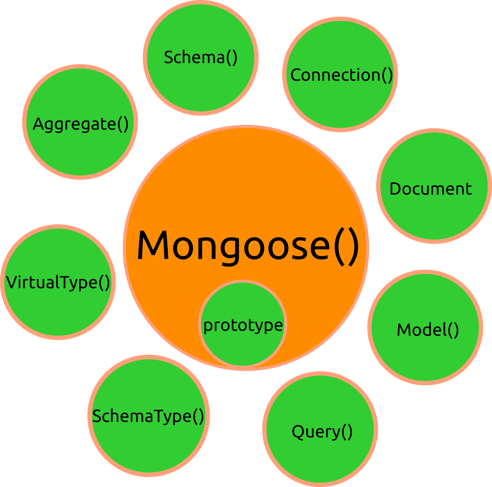

# Mongoose

Mongoose este un ORM - Object Relational Mapper. Acest lucru implică faptul că datele sunt definite ca obiecte, mai bine spus ca **modele de date** (ODM - Object Data Model). Ceea ce face efectiv un ORM este să transpună aceste modele în documentele pe care le agregă bazele de date.

De fiecare dată când Mongoose face o cerere către baza de date MongoDB, aceasta ajunge la Index-ul lui MongoDB. Indexul este o structură de date care ține minte unde se află datele în documentele organizate în colecții. Pentru fiecare colecție din MongoDB este creat un indice. Din nefericire, MongoDB face un index doar pentru id-urile documentelor. Dacă se face o căutare după numele unui câmp dintr-un document, MongoDB, va trebui să caute document cu document, ceea ce implică timpi mai mari de răspuns al datelor (*full collection scan*). O soluție pentru aceste situații ar fi implementarea unui mecanism de caching (poate Redis).

Mongoose pune la dispoziție proprietăți și constructori prin obiectul prototipal cu ajutor cărora se pot prelucra datele.



## Totul in Mongoose pornește de la o schema

Fiecare schema are drept corespondent o colecție MongoDB.

Vezi exemplul dat [la capitolul dedicat acestora](http://mongoosejs.com/docs/guide.html) din documentația oficială.
Schema indică numele câmpurilor și tipurile datelor. Un exemplu tipic este cel oferit de documentația oficială.

```javascript
  var mongoose = require('mongoose');
  var Schema = mongoose.Schema;

  var blogSchema = new Schema({
    title:  String,
    author: String,
    body:   String,
    comments: [{ body: String, date: Date }],
    date: { type: Date, default: Date.now },
    hidden: Boolean,
    meta: {
      votes: Number,
      favs:  Number
    }
  });
```

### Definirea unei scheme

#### Creează un model de date

```javascript
// creezi fișierul în app/models/bear.js

var mongoose = require('mongoose');
var Schema = mongoose.Schema;

var ResursaSchema = new Schema({
  name: String
});

module.exports = mongoose.model('Resursa', ResursaSchema);
```

Atenție, `module.exports` este obiectul returnat ca rezultat al unui apel `require` în NodeJS. Se folosește `module.exports` pentru cazul în care dorești să accesezi o funcție care să fie utilă și nu doar un simplu obiect cu proprietăți. Este și cazul nostru.

#### Cere modelul bazei de date în scriptul de server:

```js
var Resursa = require('./app/models/resursă'); //ai acces la obiectul de tip model Bear
```

Atenție, când faci cererea cu `require` folosește notație `./` pentru ca NodeJS să știe că este vorba despre un modul local.
