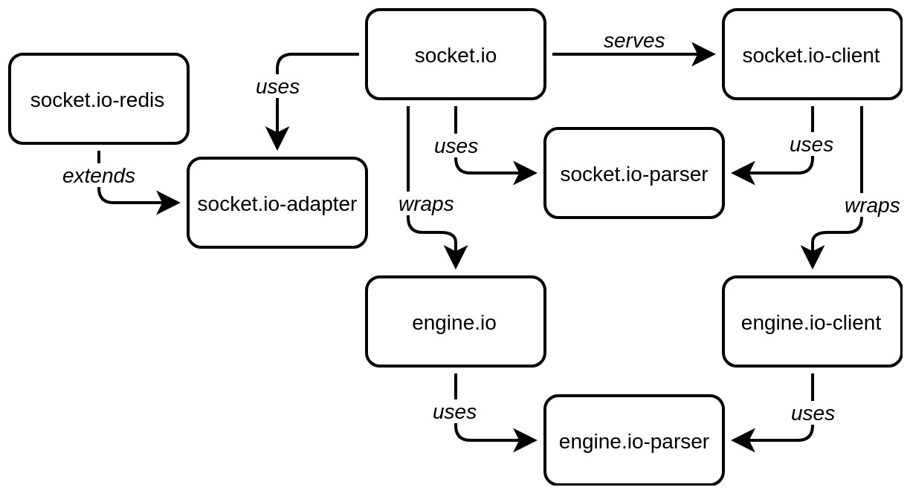

# Socket.io

## 1. Introducere

Socketurile sunt baza tuturor conexiunilor pe web. La nivelul cel mai de jos al unei conexiuni care se stabilește prin TCP (Transfer Control Protocol), socketurile de rețea[^Network socket]

[^Network socket]: [Network socket, Wikipedia]()https://en.wikipedia.org/wiki/Network_socket

 sunt stream-uri de bytes între două computere, unul cu rol de client, iar celălalt cu rol de server. Propriu-zis, ceea ce introduci byte cu byte într-o parte, apare în cealaltă parte. Atunci când apelezi un server, mai întâi se deschide o conexiune socket și apoi se trimite un header al cererii urmat de un body. Headerul și corpul sunt bytes transmiși serverului. Dimensiunea este specificată în header și astfel socketul serverului va ști când să se oprească din ascultat cererea. În cazul în care în header nu este specificat `Keep-Alive`, serverul va închide conexiunea.

Protocolul în baza căruia funcționează și serverul Socket.io este [The WebSocket Protocol (RFC 6455)](https://tools.ietf.org/html/rfc6455). Trebuie menționat din capul locului că acest protocol nu sunt socket-urile TCP descrise mai sus.

###1.1. Privire generală Socket.IO

Socket.io este o bibliotecă de cod care permite comunicare bidirecțională în timp real între clienți și un server. Un avantaj este faptul că se vor realiza conexiuni indiferent de layer-ele interpuse (proxy-uri, load balance-re, etc). Reconectarea clientului se va face automat. Socket.io folosește în subsidiar `engine.io` care este un protocol de comunicare ce va folosi tehnologii de conectare care să asigure o legătură stabilă indiferent de tehnologiile interpuse între client și server.

Pentru interacțiunea cu toți clienții care se conectează, se utilizează clasa `Socket`. Nivelul de transport este asigurat prin XHR/JSONP (numit și [long-polling](https://en.wikipedia.org/wiki/Push_technology#Long_polling)) și acolo unde este posibil, se va folosi WebSocket, dacă legătura stabilită permite. Serverul va *upgrada* conexiunea confirmând cu `*HTTP/1.1 101 Switching Protocols*` în headerul de răspuns. Acest upgrade instruiește clientul să mențină legătura cu serverul și să folosească conexiunea stabilită ca un **stream**.

Socket.io nu este o implementare a standardului WebSocket. Socket.io atașează informații suplimentare fiecărui pachet (tip pachet și namespace, ack id) și din acest motiv nu se poate conecta la servere WebSocket.

Un client care a reușit să facă o conexiune, va sta conectat pe termen nedefinit, iar atunci când serverul nu mai este disponibil, va încerca să se conecteze fără a se deconecta. Acest lucru este posibil pentru că Socket.io implementează un mecanism de sincronizare prin care cele două părți află despre starea celuilalt. Mecanismul implică setarea de timere în ambele părți, care măsoară intervalele de timp în care răspunsul este primit la momentul când este inițiată comunicarea (etapa de handshake). Aceste timere necesită ca toate cererile ulterioare ale clientului să fie direcționate către același server. În cazul în care sunt folosite mai multe noduri (multiple servere sau un cluster), este necesară folosirea unui mecanism intermediar de gestiune a împerechierii cererii cu serverul sau worker-ul. Acesta se numește *sticky-session*. Pentru mai multe detalii, vezi [*stiky load balancing*](https://socket.io/docs/using-multiple-nodes/).

Este posibilă și o comunicare a datelor în format binar. Din browser datele pot fi emise ca `ArrayBuffer` sau `Blob`, iar din Node.js ca `ArrayBuffer` și `Buffer`.
Pentru a separa canalele de comunicare, `Socket.io` permite realizarea de zone separate în funcție de modelul de comunicare sau separația resurselor. Aceste spații sunt numite *namespaces*. Acestea se comportă precum canale separate de comunicare. Aceste canale separate, vor folosi aceeași conexiune creată în baza multiplexării.

În fiecare namespace, poți crea zone diferite numite *rooms* (canale arbitrare). Expunerea serverului se face pur și simplu prin cererea modului `socket.io`. Va fi returnat un constructor, care acceptă un argument. Acesta este un server HTTP.

```javascript
var io = require('socket.io')();
// sau
const Server = require('socket.io');
const io = new Server();
```

Clientul se va conecta la server pentru că acesta este expus pe server pe calea `/socket.io/socket.io.js`; `<script src="/socket.io/socket.io.js"></script>`. Același script de conectare, poate fi adus de la `https://cdnjs.com/libraries/socket.io`. Pentru a fi folosit cu Browserify și Webpack, se va instala pachetul de client: `npm install --save socket.io-client`.

To clientul va trebui ca în scriptul principal pe care îl va încărca în pagină, să inițieze comunicarea cu serverul creând o instanță: `var socket = io()`. Dacă invoci obiectul fără niciun argument, descoperirea serverului din backend se va face automat.

### 1.2. Long polling

Traducerea termenului *polling* în limba română este de *apel selectiv*, iar în interacțiunea unui client cu serverul, această activitate ar putea privită ca un dialog permanent cu scopul de a menține o legătură continuă care să permită serverului să trimită un răspuns la un moment dat. Această activitate trebuie privită din perspectiva standardului HTTP, care nu este proiectat să mențină o legătură permanentă, ci doar apeluri la care se răspunde punctual cu o resursă. Polling-ul de bază se realizează cu API-ul `XMLHttpRequest` (*Asynchronous JavaScript and XML* - AJAX), iar în cazul în care nu există suport pe server pentru long pooling, acesta poate fi făcut folosind `JSONP`. Marele dezavantaj al acestei tehnici este că are nevoie de resurse considerabile de calcul, memorie și bandă.

Odată cu evoluția Internetului, necesitatea de a dezvolta aplicații în client care să ofere facilitatea de comunicarea în timp real cu serverul, a condus la apariția faimosului API `XMLHttpRequest` în browser în periada *Războiului browserelor*. Acest API a deschis drumul manipulării modelului de comunicare HTTP bazat pe cerere - răspuns într-unul care să pară a fi *real time*. Unul din acest modele se numește **long polling**[^Push technology].

[^Push technology]: Acest model face parte din suita care generic se numesc tehnologii de push. Pentru mai multe detalii, vezi [Push technology, Long pooling, Wikipedia](https://en.wikipedia.org/wiki/Push_technology#Long_polling)

Spre deosebire de celelalte tehnici, long polling-ul va încerca să mențină deschisă o conexiune cât mai mult posibil, oferind clientului un răspuns atunci când date proaspete sunt disponibile. Long polling-ul implementează `XMLHttpRequest`.

Implementarea unui astfel de model implică sprijinul serverului, care să accepte astfel de conexiuni specializate. Din partea clientului se așteaptă ca acesta să fie capabil de a gestiona o singură conexiune, cea către server. Atunci când clientul primește date, va mai iniția o conexiune după și așa mai departe, legătura cu serverul părând a fi neîntreruptă. De fapt, există mici pauze, care sunt gândite pentru a degreva serverul de încărcare. Aceste pauze pot parametrizabile prin setarea header-ului `Keep-Alive` în momentul în care clientul așteaptă un răspuns.

Serverul are o misiune mai delicată pentru că trebuie să gestioneze starea în care se află conexiunile. În cazul în care avem de a face cu o arhitectură mai complexă (multiple servere cu balans), care necesită constituirea unui adevărat mecanism care să țină evidența stării conexiunii. Atributul folosit pentru managementul stării în arhitecturi complexe este **stickiness**, **session stickiness**.

Acest mecanism de gestiune a stării conexiunii, va avea în sarcină și rezolvarea problemelor de timeout, care ar putea apărea dată fiind parcurgerea mai multor componente software posibile: servere, balance-re, proxy-uri, etc. Pentru evitarea complexităților pe care le-a angajat *long polling*-ul cu scopul de a oferi o comunicare apropiată de real-time, a fost proiectat un protocol țintit către comunicare bidirecțională: `WebSockets` sau `WebRTC`. Apariția acestui standard este de dată recentă și încă mediul de dezvoltare are nevoie de a maturiza soluții de implementare.

În cazul Socket.io, este folosită tehnica de long polling pentru a stabili conexiunea și apoi se face un salt, dacă este posibil și suportat la comunicarea pe websockets. Reține faptul că diferite arhitecturi de comunicare (proxy-uri, *balancer*e) vor bloca comunicarea pe Websockets și din acest motiv încă este nevoie de long polling. Un alt motiv este suportul, care în momentul acesta încă nu este uniform.

Long polling-ul este un artificiu de comunicare peste modelul HTTP, care vine cu un set de probleme. De exemplu, ordonarea mesajelor în cazul în care un client deschide mai multe tab-uri și astfel, mai multe cereri către server fără posibilitatea de a le ordona. În scenariile în care datele sunt păstrate pe client, așa cum pot fi token-uri de autentificare, este posibil ca acestea să fie suprascrise, dacă se folosesc mecanisme de persistență precum `localStorage` sau `IndexDb`.

Alte probleme apar atunci când dorești distribuirea conexiunilor pe mai multe procese sau servere folosindu-se mecanisme de ***sticky session***. De exemplu, toate conexiunile de pe un domeniu pot *ateriza* pe un singur proces, restul nefiind încărcate deloc. Un alt exemplu este legat de posibilitatea ca un atacator să declanșeze un DoS pentru că alocarea pe servere/procese este un determinată de IP-uri care pot fi aflate, și de aici o suprafață de atact facilă.

Pentru a nu gestiona deficiențele pe care long polling-ul le aduce, este de dorit lucrul doar cu clienți care suportă websockets. Soluția pentru clienții care accesează serverul de după proxy-uri sau alte filtre este securizarea canalului de comunicare prin TSL: `https://` în loc de `http://` și `wss://` în loc de `ws://`.

### 1.3. Universul socket-io



## Sticky load balancing

În cazul unor aplicații de mari dimensiuni, dacă dorești să distribui încărcătura conexiunilor pe mai multe mașini sau folosind mai mulți workeri (procese), trebuie să te asiguri de faptul că o cerere asociată cu anume id de sesiune se conectează cu procesul sau serverul din care sunt originare. Acest mecanism de load balancing, care să identifice cererea cu procesul (să le facă *sticky*) este absolut necesar de etapa de long pooling până la momentul upgradării conexiunii la websockets.

Trebuie să luăm mereu în considerare faptul că anumiți clienți nu au capacitatea de a comunica pe websockets, ceea ce îi va determina să folosească long polling-ul. În acest caz, este posibil ca o conectare să se fi făcut la server, dar nu au apucat să trimită vreo crere către acesta. Documentația oficială indică necesitatea unui instrument cu care să se constituie un tampon în procesul care gestionează conexiunea pe long polling. Datele vor fi scrise într-o etapă intermediară pentru ca alți clienți care au suport pentru websockets, fiind mai rapizi, trebuie să scrie datele pe care ei le emit și celor care folosesc long polling-ul.

În cazul în care nu oferi suport pentru long pooling, poți limita lucrul doar la websockets.

```javascript
const client = io('https://unsite.ro', {
    transports: ['websocket']
});
```

Varianta de suport din oficiu, oferă și long polling și ar fi echivalentă cu menționarea explictă.

```javascript
const client = io('https://unsite.ro', {
    transports: ['websocket', 'polling']
});
```


## 14. Debugging

Socket.io folosește în scopuri de depanare (debugging), modulul npm `debug`.

### 14.1. Nivel de client

În codul clientului poți introduce o secvență care va folosi mecanismul de stocare local al browserului.

```javascript
localStorage.debug = '*';                            // logging-ul arată totul
localStorage.debug = 'engine.io-client:polling-xhr'; // logging pe anumite segmente
```

Poți introduce mai multe zone de interes pentru debugging.

```javascript
localStorage.debug = 'engine.io-client:polling, engine.io-client:socket';
```

### 14.2. Nivel de server

La nivel de server, pentru a porni debuging-ul, vei porni aplicația folosind variabila de mediu `DEBUG`.

```bash
DEBUG=* node server
```

Ca să nu mai menționezi `DEBUG=*`, cel mai bine ar fi să faci un `export DEBUG=*`. Apoi vei putea porni aplicația în mod normal, dar vei beneficia de debugging.

Pentru a întrerupe acest comportament, se va face un `export DEBUG=null`.

Pentru a face logging doar pentru socket.io, vei proceda la un `export DEBUG=socket.io:server node server`.

## Referințe

- [The WebSocket Protocol | RFC 6455](https://tools.ietf.org/html/rfc6455)
- [WebSockets - A Conceptual Deep-Dive](https://www.ably.io/concepts/websockets)
- [Long Polling - Concepts and Considerations](https://www.ably.io/concepts/long-polling)
- [Known Issues and Best Practices for the Use of Long Polling and Streaming in Bidirectional HTTP: draft-loreto-http-bidirectional-07](https://tools.ietf.org/id/draft-loreto-http-bidirectional-07.html)
- [HTML5 WebSocket: A Quantum Leap in Scalability for the Web](http://websocket.org/quantum.html)
- [HTMLLiving Standard — Last Updated 23 February 2019](https://html.spec.whatwg.org/multipage/web-sockets.html)
- [The Myth of Long Polling](https://blog.baasil.io/why-you-shouldnt-use-long-polling-fallbacks-for-websockets-c1fff32a064a)
- [Why you don’t need Socket.IO](https://codeburst.io/why-you-don-t-need-socket-io-6848f1c871cd)
