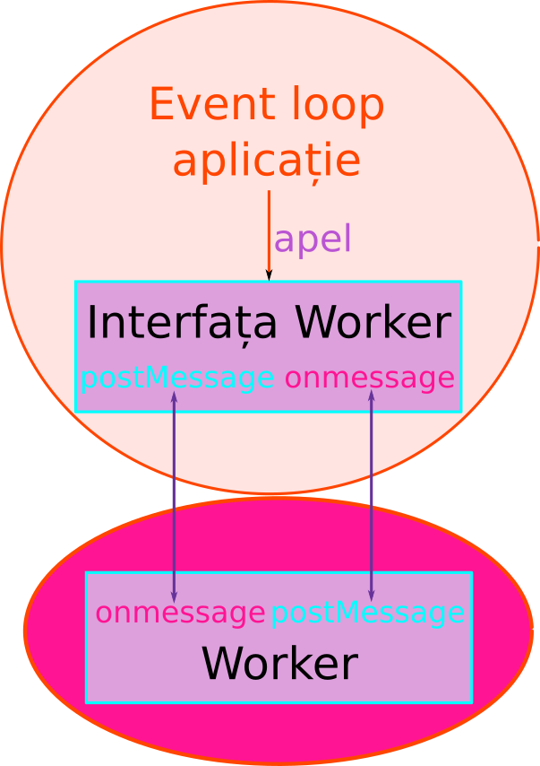

# webworker-threads



Pentru a realiza această interfațare, am putea avea următorul șablon de cod.

```javascript
    var worker = new Worker(function () {
        this.onmessage = function () {
            // this este referința către însuși obiectul de thread
            /* 
            În această funcție va fi introdus codul care taxează resursele
            computerului care altfel ar bloca firul principal.
            */
            postMessage();
        };// ce se intamplă cand primesti mesaj din threadul principal
    }); // Interfață creată
    worker.onmessage = function () {
    
    }; // listener pentru cazul în care avem un mesaj din worker
    worker.postMessage(); // pentru a comunica cu worker-ul
```

Pentru o viziune completă, vom folosi `webworker-threads` într-o construcție asemănătoare cu următoarea.

```javascript
const express = require('express');
const app = express();
const crypto = require('crypto');
const Worker = require('webworker-threads').Worker;

app.get('/', (req, res) => {
    var worker = new Worker(function () {
        this.onmessage = function () {
            // this este referința către însuși obiectul de thread
            let contor = 0;
            while (contor < 1e9) {
                contor++;
            };
            postMessage(contor);
        };// ce se intamplă cand primesti mesaj din threadul principal
    }); // Interfață creată
    worker.onmessage = function (mesaj) {
        res.send('' + mesaj.data); // fă un cast, altfel, Express crede că vrei să trimiti un status number        
    }; // listener pentru cazul în care avem un mesaj din worker
    worker.postMessage(); // pentru a comunica cu worker-ul
});

app.get('/rutarapida', (req, res) => {
    res.send('S-a încărcat folosind un copil');
});

app.listen(3000);
```